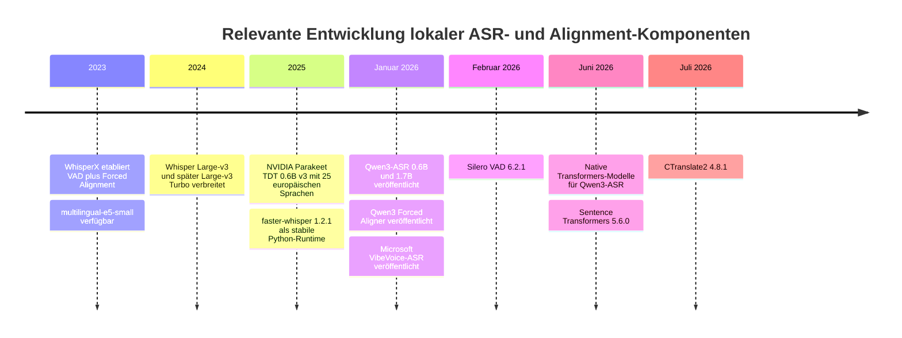
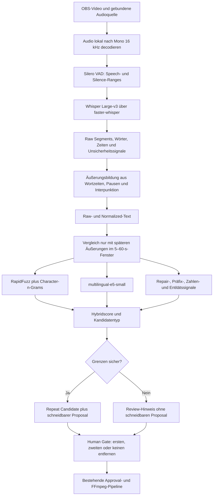

# Lokale Erkennung von Wiederholungen und Selbstkorrekturen in deutsch-englisch gemischten Videos

## Executive Summary und Entscheidung

### Kernergebnis

Der kleinste bereits weitgehend gelöste lokale Ansatz besteht **nicht** aus einem speziellen „Repeated-Take-Modell“. Die belastbare Lösung ist eine Kombination aus etablierten Komponenten:

```text
Whisper Large-v3 über faster-whisper/CTranslate2
→ integriertes Silero VAD
→ Wortzeitstempel und Äußerungsbildung
→ lokaler Vergleich nur innerhalb eines kurzen Zeitfensters
→ RapidFuzz + Character-n-Grams + multilingual-e5-small
→ kleiner Bonus für Reparaturmarker
→ Boundary-Safety-Prüfung
→ Kandidatenpaar im bestehenden Human Gate
```

Die eigentliche Neuentwicklung beschränkt sich damit auf ungefähr fünf überschaubare Bausteine: Äußerungsbildung, Nachbarschaftssuche, hybrides Scoring, Kandidatenklassifikation und Übergabe an das bestehende Human Gate. ASR, VAD, Zeitstempel, Textähnlichkeit und Embeddings sind bereits als ausgereifte lokale Libraries verfügbar.

Diese Schlussfolgerung folgt unmittelbar aus dem angegebenen Produktziel: Es wird kein Publikationstranskript und keine autonome Löschung benötigt, sondern eine recall-orientierte Markierung zeitnaher Wiederholungen, Neuansätze und Korrekturen zur menschlichen Entscheidung. fileciteturn0file0

### Primäre Empfehlung

| Komponente | Konkrete Wahl |
|---|---|
| ASR-Modell | `Systran/faster-whisper-large-v3`, fest an eine Hugging-Face-Revision gebunden |
| Runtime | `faster-whisper==1.2.1`, `ctranslate2==4.8.1` |
| GPU-Modus | NVIDIA CUDA 12, cuDNN 9, zunächst `int8_float16` |
| Sprache | dominante Sprache Deutsch; eingebettetes Englisch nicht übersetzen |
| Decoding | Beam 5, Temperature 0, `condition_on_previous_text=False` |
| Zeitinformationen | native Wort- und Segmentzeitstempel von faster-whisper |
| Segmentierung | integriertes Silero VAD plus Pausen-, Interpunktions- und Längenregeln |
| Lexikalische Ähnlichkeit | `RapidFuzz==3.14.5`, Token-Set/Edit-Distanz |
| Robuste Oberflächenähnlichkeit | Character-n-Grams, lokal mit scikit-learn oder eigener kleiner Implementierung |
| Semantische Ähnlichkeit | `sentence-transformers==5.6.0` mit `intfloat/multilingual-e5-small` |
| Hotwords | kleine statische faster-whisper-Hotwordliste, optional und konservativ |
| Forced Alignment | zunächst keines |
| Schnittentscheidung | ausschließlich bestehendes Human Gate |

Faster-whisper ist eine CTranslate2-Implementierung von Whisper, unterstützt GPU-Quantisierung, Wortzeitstempel und ein integriertes Silero VAD. Der offizielle Projektbenchmark berichtet für das vergleichbar große Whisper-Large-v2 auf einer RTX 3070 Ti 8 GB ungefähr 4,5 GB VRAM und 63 Sekunden für 13 Minuten Audio in FP16 beziehungsweise etwa 2,9 GB und 59 Sekunden in INT8. Die Messung ist keine Garantie für Large-v3 oder andere Hardware, zeigt aber, dass 45- bis 90-minütige Aufnahmen lokal deutlich schneller als Echtzeit verarbeitet werden können. citeturn16view0

**Eigene Schlussfolgerung:** Full Large-v3 ist hier gegenüber Large-v3 Turbo vorzuziehen. Turbo reduziert den Decoder von 32 auf vier Schichten und ist dadurch erheblich schneller, akzeptiert dafür aber ausdrücklich eine leichte Qualitätsverschlechterung. Bei starkem deutsch-englischem Code-Switching, Eigennamen und Finanz- beziehungsweise Softwareterminologie ist die zusätzliche Genauigkeitsreserve sinnvoller als die eingesparte Transkriptionszeit. citeturn21search4turn21search10turn21search15

### Empfohlener Fallback

Falls Large-v3 in der kleinen realen Probe bei englischen Einschüben, Modellnamen, Tickern oder korrigierten Zahlen zu viele relevante Kandidaten verliert, lautet der einzige empfohlene Fallback:

```text
Qwen3-ASR-1.7B-hf
+ Qwen3-ForcedAligner-0.6B-hf
+ Transformers-Backend
+ dieselbe Segmentierungs- und Ähnlichkeitsschicht
```

Qwen3-ASR unterstützt Deutsch und Englisch sowie insgesamt 52 Sprachen und Dialekte; der zugehörige Forced Aligner unterstützt unter anderem Deutsch und Englisch und liefert Wort- oder Zeichenzeitstempel. Seit dem 26. Juni 2026 stehen offizielle Transformers-kompatible Modellvarianten zur Verfügung. Die Modelle und das Repository sind Apache-2.0-lizenziert. citeturn17view1turn17view2turn17view3

Qwen ist **nicht** die Primärwahl, weil die Integration jünger, speicherintensiver und unter Windows riskanter ist. Die offizielle Runtime bietet zwar sowohl Transformers als auch vLLM, doch vLLM bringt zusätzliche Prozess-, CUDA- und Kompatibilitätskomplexität. Für einen Windows-Cutter sollte der Fallback deshalb ausdrücklich das normale Transformers-Backend und nicht vLLM verwenden. Das offizielle Beispiel lädt ASR und Aligner separat in BF16 auf die GPU; Zeitstempel sind nur mit dem zusätzlichen Aligner verfügbar. citeturn17view0turn17view2

### Entscheidung in einem Satz

> **Implementiere zuerst faster-whisper mit Whisper Large-v3, Silero VAD und einem hybriden lokalen Nachbarschaftsvergleich aus RapidFuzz, Character-n-Grams und multilingual-e5-small; verwende Qwen3-ASR-1.7B plus Qwen3 Forced Aligner nur als genau einen Fallback, falls die reale deutsch-englische Sanity-Probe eine ASR-bedingte Recall-Lücke zeigt.**

## Forschungsrahmen und Evidenzlage

### Forschungsfragen

Die Untersuchung wurde auf vier operative Fragen reduziert:

| Forschungsfrage | Arbeitshypothese |
|---|---|
| Kann Wiederholungserkennung trotz fehlerhafter Fachbegriffe funktionieren? | Ja. Wiederholungen erzeugen häufig ähnliche Fehler, und hybride Oberflächen- plus Semantiksignale kompensieren viele variierende Fehler. |
| Ist ein spezielles Repair- oder Disfluency-Modell erforderlich? | Nein. Für ein Human Gate genügt wahrscheinlich eine recall-orientierte Kandidatensuche mit Reparaturmarkern. |
| Reichen native ASR-Zeitstempel für Review und Schnitte? | Für Review ja; für sichere Schnitte nur in Verbindung mit VAD, Pausen und einer Boundary-Safety-Prüfung. |
| Welcher Stack minimiert Windows-, CUDA- und Implementierungsrisiken? | faster-whisper/CTranslate2 ist deutlich reifer und kleiner als neue 2026er Long-Form- oder End-to-End-Systeme. |

Die Hypothesen beziehen sich bewusst auf **Kandidatenerkennung**, nicht auf vollautomatische Textbereinigung. In der Disfluency-Forschung werden Wiederholungen, Reparaturen und Fehlstarts häufig als zu entfernende Tokens oder als Textkorrekturproblem behandelt. Das DISCO-Korpus enthält Deutsch, Englisch, Französisch und Hindi und zeigt, dass deutsche Disfluency-Korrektur grundsätzlich modellierbar ist; es löst jedoch weder die zeitliche Paarbildung zweier Takes noch sichere Videoschnittgrenzen. citeturn19academia47

### Priorisierte Suchstrategie

Die Quellen wurden in folgender Rangfolge bewertet:

1. offizielle Model Cards, Dokumentation und Original-Repositories;
2. technische Berichte und begutachtete beziehungsweise veröffentlichte Papers;
3. offizielle Benchmarks, sofern Hardware und Einstellungen genannt wurden;
4. Open-Source-Repositories mit übernehmbaren Komponenten;
5. GitHub-Issues und Nutzerberichte zur Identifikation praktischer Risiken;
6. kommerzielle Produkte als Nachweis, dass das Produktmuster funktioniert, nicht als technische Implementierungsquelle.

Benchmarks verschiedener Anbieter sind nicht unmittelbar vergleichbar. Hersteller messen mit unterschiedlichen Sprachen, Audiotypen, Segmentlängen, Hardwarekonfigurationen und Decoding-Einstellungen. Deshalb wird keine vermeintlich exakte Rangliste aus heterogenen WER-Werten konstruiert.

### Annahmen und offene Randbedingungen

Die Empfehlung setzt voraus, dass überwiegend ein Sprecher, ordentliches OBS-Mikrofonaudio und wenig echte Sprecherüberlappung vorliegen. GPU-Modell und VRAM wurden nicht spezifiziert. Die primäre Konfiguration zielt daher auf eine typische NVIDIA-Karte mit mindestens etwa 8 GB VRAM; bei 6 GB oder weniger muss gegebenenfalls stärker quantisiert oder auf Turbo ausgewichen werden, was jedoch erst nach einer realen Speicherprüfung entschieden werden sollte.

Der Begriff „zuverlässig“ wird hier als **ausreichender Recall bei beherrschbarer Zahl falscher Review-Hinweise** verstanden. Das System muss nicht autonom entscheiden, welcher Take schlechter ist. Es muss nur beide relevanten Passagen finden und nachvollziehbare Gründe anzeigen.

### Entwicklungslinie der relevanten Komponenten

Die jüngsten Modelle erweitern die Möglichkeiten, ändern aber nicht zwingend die minimale Architektur. Parakeet TDT 0.6B v3 erschien 2025 als multilingualer schneller ASR-Kandidat; Qwen3-ASR und VibeVoice-ASR folgten Anfang 2026, und Qwen veröffentlichte im Juni 2026 native Transformers-Unterstützung. Gleichzeitig blieben faster-whisper, Silero VAD und Sentence Transformers die risikoärmeren Bausteine für eine kleine Windows-Integration. citeturn17view3turn17view4turn17view7turn20search0



## Modell- und Komponentenvergleich

### Vergleich der ernsthaften ASR-Kandidaten

| Kandidat | Deutsch und Englisch | Code-Switching und Fachbegriffe | Zeitstempel und Biasing | Ressourcen und Betrieb | Bewertung für dieses Projekt |
|---|---|---|---|---|---|
| **Whisper Large-v3 über faster-whisper** | Starke etablierte mehrsprachige Basis; Large-v3 hat 1,55 Mrd. Parameter | Kein spezielles Code-Switching-Modell, aber breit trainiert; Prompt und Hotwords verfügbar | Native Segment- und Wortzeitstempel; Segment- und Wortsignale für Unsicherheit; Silero VAD integriert | Windows-Wheels, CUDA 12/cuDNN 9, INT8/FP16, MIT | **Primärwahl:** bestes Verhältnis aus Reife, Genauigkeit und Integrationsaufwand |
| **Whisper Large-v3 Turbo** | Gleiche Sprachfamilie, 809 Mio. Parameter | Schneller, aber reduzierte Decoderkapazität; Qualitätsverlust offiziell eingeräumt | Gleiche faster-whisper-Infrastruktur | Modell kleiner; gut bei knapper VRAM- oder Zeitgrenze | Nicht zunächst verwenden; Genauigkeitsreserve ist wichtiger |
| **whisper.cpp** | Breite Whisper-Unterstützung | Sehr portable Runtime, aber im Ausgangssystem bereits problematisch | Wortzeitstempel möglich; aktuelle Issues dokumentieren fehlerhafte oder zusammengezogene Zeitachsen | Sehr gute Windows- und Offline-Eignung, MIT | Nicht erneut zum Mittelpunkt machen; vorhandene Fehltranskriptionen und Timingrisiken |
| **Qwen3-ASR-1.7B plus Aligner** | Deutsch und Englisch offiziell unterstützt | Wahrscheinlich besonders interessant für moderne Begriffe; echte deutsche Code-Switching-Datenlage bleibt begrenzt | Separater 0.6B-Aligner für Wort-/Zeiten; kein ebenso reifer einfacher Hotwordpfad | BF16-Transformers, höherer VRAM-Bedarf; Apache 2.0 | **Fallback:** hohe potenzielle Qualität, aber jüngerer und größerer Stack |
| **Qwen3-ASR-0.6B** | Gleiche unterstützte Sprachen | Effizienter, vermutlich geringere Reserve bei Eigennamen und schwierigen Einschüben | Zeitstempel ebenfalls nur mit Aligner | Deutlich kleiner als 1.7B | Kein zusätzlicher Fallback nötig; 1.7B ist der sinnvolle Qualitätsfallback |
| **NVIDIA Parakeet TDT 0.6B v3** | 25 europäische Sprachen einschließlich Deutsch und Englisch | Keine belastbare offizielle Aussage zu Intra-Satz-Code-Switching oder Hotword-Biasing | Wort-, Segment- und sogar Zeichenzeitstempel | 600 Mio. Parameter; NeMo/Transformers; CC BY 4.0 | Technisch attraktiv, aber weniger passend zu gemischter Terminologie und Windows-Minimalismus |
| **Microsoft VibeVoice-ASR** | Über 50 Sprachen, Code-Switching ausdrücklich unterstützt | Hotwords und Code-Switching sind Kernfunktionen | Integrierte Sprecher-, Inhalts- und Zeitstruktur | 9 Mrd. Parameter, große BF16-Weights, höheres Verbraucher-GPU-Risiko; MIT | Funktional passend, aber massiv überdimensioniert |
| **WhisperX** | ASR über faster-whisper plus sprachspezifischen Alignment-Encoder | ASR-Qualität bleibt Whisper-abhängig | Präziseres Forced Alignment; Probleme bei Zahlen und unbekannten Zeichen | Zusätzliche Modelle, Abhängigkeiten und GPU-Übergaben | Nur ergänzen, wenn native Wortzeiten real nachweislich nicht genügen |

Whisper Large-v3 verwendet rund 1,55 Milliarden Parameter; das veröffentlichte CTranslate2-Modell umfasst ungefähr 3,09 GB. Faster-whisper unterstützt FP16 und gemischtes INT8/FP16, Wortzeitstempel, Silero VAD und lokale Modellverzeichnisse. Das Repository nennt Python 3.9 oder neuer, CUDA 12 und cuDNN 9 für aktuelle CTranslate2-Versionen sowie einen Windows-kompatiblen Weg zur Bereitstellung der CUDA-Libraries. citeturn15search1turn16view0turn21search15

Large-v3 Turbo reduziert den Decoder von 32 auf vier Schichten. Die offizielle Model Card beschreibt das Modell als erheblich schneller mit einem kleineren Qualitätsverlust; das veröffentlichte Modell liegt je nach Revision beziehungsweise Speicherformat ungefähr bei 1,62 GB. citeturn21search4turn21search14

Bei whisper.cpp wurden auch 2026 offene Timingprobleme gemeldet: Ein Issue beschreibt falsche Wortzeiten, ein anderes das unerwünschte Zusammenziehen von Zeitstempeln über vorhandene Stillelücken. Einzelne Issues beweisen kein generelles Versagen, sind aber angesichts der bereits beobachteten Fehltranskriptionen ein ausreichender Grund, nicht noch mehr Logik an diese Runtime zu koppeln. citeturn21search7turn21search16

NVIDIA Parakeet TDT 0.6B v3 unterstützt Deutsch und 24 weitere europäische Sprachen, automatische Interpunktion sowie Wort-, Segment- und Zeichenzeitstempel. Die Model Card nennt bis zu 24 Minuten mit Full Attention auf einer A100 80 GB beziehungsweise bis zu drei Stunden mit Local Attention. Sie dokumentiert jedoch kein speziell für den Anwendungsfall geeignetes Hotword- oder Code-Switching-Verfahren. citeturn17view4turn17view5turn17view6

VibeVoice-ASR passt auf dem Papier hervorragend: Das Modell unterstützt mehr als 50 Sprachen, native Sprachwechsel, benutzerdefinierten Kontext beziehungsweise Hotwords und bis zu 60 Minuten Audio in einem Durchlauf. Das veröffentlichte Modell hat jedoch ungefähr neun Milliarden Parameter und führt zusätzlich Diarisierung und Long-Context-Generierung aus, die bei einem einzelnen Sprecher nicht benötigt werden. Ein Nutzerbericht vom Februar 2026 nennt bei einer 4-Bit-Quantisierung ungefähr 250 Sekunden Rechenzeit für 300 Sekunden Audio und fragt ausdrücklich nach Lösungen für GPUs mit höchstens 16 GB VRAM. citeturn18search0turn18search4turn18search14

### Unsicherheitssignale

Faster-whisper stellt unter anderem Spracherkennungswahrscheinlichkeit, Segmentwerte wie `avg_logprob` und `no_speech_prob` sowie Wahrscheinlichkeitswerte an Wörtern bereit. Diese Werte sind nützlich für Priorisierung und UI-Hinweise, dürfen aber nicht als kalibrierte Fehlerwahrscheinlichkeit interpretiert werden. citeturn9search0turn9search2turn10search2

Empfohlene Nutzung:

| Signal | Verwendung |
|---|---|
| niedriger durchschnittlicher Log-Score | Kandidat nicht verwerfen, sondern als „ASR unsicher“ kennzeichnen |
| hohes `no_speech_prob` | Segment oder Boundary überprüfen |
| niedrige Wortwahrscheinlichkeit bei Name/Zahl | geänderten Token im Human Gate farblich hervorheben |
| instabile Spracherkennung | kein autonomes Umschalten pro Wort; dominant deutsch beibehalten |
| hohe Ähnlichkeit trotz niedriger ASR-Sicherheit | besonders interessanter Wiederholungs- oder Reparaturkandidat |

### Forced Alignment

WhisperX kombiniert VAD, schnelleres batched Whisper-Decoding und wav2vec2-basiertes Forced Alignment. Das ist eine bewährte Lösung für genaue Untertitel, hat aber bekannte Grenzen: Zahlen beziehungsweise Tokens außerhalb des Alignment-Wörterbuchs können ohne Zeitstempel bleiben, und ein 2025er Issue dokumentiert mehrsekündige Fehler bei alphanumerischen Bezeichnern. Gerade Zahlen, Ticker und Modellbezeichnungen gehören hier zu den kritischen Korrekturtypen. citeturn21search0turn21search6turn21search8

Der Qwen3 Forced Aligner unterstützt beliebige Text-Speech-Paare in elf Sprachen einschließlich Deutsch und Englisch. Das ist technologisch interessant, sollte aber nur gemeinsam mit dem Qwen-Fallback eingeführt werden; ein separater Qwen-Aligner hinter Whisper würde die Architektur ohne nachgewiesenen Produktnutzen vergrößern. citeturn17view1turn17view2

**Entscheidung:** Native faster-whisper-Wortzeiten plus VAD sind für die erste Implementierung ausreichend. Forced Alignment wird erst aktiviert, wenn reale Schnitttests zeigen, dass sichere Grenzen wiederholt nicht bestimmbar sind.

### Hotwords und minimales Vokabular

Faster-whisper unterstützt einen `hotwords`-Parameter und einen allgemeinen Initial Prompt. Im aktuellen Codepfad wirken Hotwords nicht gleichzeitig mit einem gesetzten Prefix; deshalb sollten Initial Prompt und Hotwords nicht unkontrolliert kombiniert werden. citeturn10search2

Empfohlen wird eine statische, versionskontrollierte Liste von zunächst höchstens etwa 20 bis 50 Einträgen, zum Beispiel:

```text
Nasdaq
S&P 500
Liquidity Sweep
Orderflow
Claude Code
Codex
Fibonacci Retracement
OpenAI
Anthropic
Bitcoin
Ethereum
BTC
ETH
```

Jeder Begriff sollte zusätzlich einige offensichtliche Schreibvarianten in der **Textnormalisierung**, nicht zwingend als weitere Hotwords, erhalten:

```text
S&P 500 ↔ SP500 ↔ S and P 500 ↔ S und P 500
Claude Code ↔ Cloud Code
Nasdaq ↔ NASDAQ
BTC ↔ Bitcoin
```

Hotword-Biasing darf nur ein Hilfsmittel sein. Ein offenes Qwen-Issue berichtet, dass ein Hotwordmechanismus bei ähnlich klingender Sprache wiederholt Inhalte aus der Hotwordliste ausgeben konnte. Das Issue betrifft eine Qwen-Streaming-Konfiguration und nicht faster-whisper, belegt aber das allgemeine Risiko zu starker Kontextbiases. citeturn18search13

Daher gelten drei Regeln:

- Die Rohtranskription ohne nachträgliche Ersetzung bleibt als Evidence erhalten.
- Hotwords werden nicht automatisch aus bisherigen Aufnahmen gelernt.
- Nach Hinzufügen neuer Begriffe wird geprüft, ob ihre Falschpositivrate steigt.

## Wiederholungs- und Repair-Erkennung

### Ist perfekte Transkription erforderlich?

**Nein.** Für den vorliegenden Anwendungsfall ist ein ausreichend stabiles Rohtranskript wichtiger als ein perfektes.

Es gibt drei typische Fälle:

| ASR-Verhalten | Wirkung auf Wiederholungserkennung |
|---|---|
| Ein Fachbegriff wird in beiden Takes identisch falsch transkribiert | Lexikalische Ähnlichkeit bleibt hoch; Wiederholung ist meist leicht erkennbar |
| Der Begriff wird unterschiedlich falsch transkribiert | Character-n-Grams, umgebender Satzkontext und semantisches Embedding können die Abweichung auffangen |
| Die zweite Passage korrigiert gezielt Zahl oder Namen | Die Umgebung bleibt ähnlich, der geänderte Token wird als Korrekturdifferenz hervorgehoben |

Beispiel:

```text
Take A: Der Liquidity Sweep liegt über dem gestrigen High.
Take B: Der Liquiditätssweep liegt über dem gestrigen High.
```

Trotz fehlerhafter oder inkonsistenter Schreibung sind Tokenfolge, Character-Teilfolgen und Satzbedeutung fast identisch.

Anderes Beispiel:

```text
Take A: Der Widerstand liegt bei 67.500 Dollar.
Take B: Nein, ich meine 67.800 Dollar.
```

Ein reines Duplikatsystem könnte die Zahlendifferenz als geringfügigen Fehler abwerten. Das gewünschte System muss dagegen erkennen:

```text
hohe Kontextähnlichkeit
+ abweichende Zahl
+ Korrekturmarker „nein, ich meine“
= besonders wichtiger Korrekturkandidat
```

Semantische Embeddings dürfen daher **nicht allein** über Duplikate entscheiden. Sie können Zahl-, Negations- und Entitätsunterschiede zu stark glätten. Der Token-Diff muss erhalten bleiben.

### Warum ein hybrider Score genügt

Die erste Stufe sollte ausschließlich zeitlich benachbarte Äußerungen vergleichen. Eine globale Vektordatenbank, Approximate-Nearest-Neighbor-Infrastruktur oder Aufnahme-übergreifende Suche ist unnötig.

Für jede Äußerung \(u_i\) werden nur spätere Äußerungen \(u_j\) betrachtet, deren Startzeit ungefähr 5 bis 60 Sekunden nach dem Ende von \(u_i\) liegt. Ein engeres Standardfenster von etwa 5 bis 30 Sekunden kann zunächst die Zahl thematisch ähnlicher, aber nicht wiederholter Passagen begrenzen.

Empfohlener Startscore, ausdrücklich als **engineering heuristic** und nicht als wissenschaftlich kalibrierte Formel:

\[
S = 0{,}35L_\text{Token}
  + 0{,}25L_\text{Char}
  + 0{,}25S_\text{E5}
  + 0{,}10S_\text{Struktur}
  + 0{,}05B_\text{Repair/Distanz}
\]

Dabei bedeuten:

| Teilscore | Inhalt |
|---|---|
| \(L_\text{Token}\) | RapidFuzz `token_set_ratio`, normalisierte Levenshtein- oder LCS-Ähnlichkeit |
| \(L_\text{Char}\) | Cosinus- oder Jaccard-Ähnlichkeit aus Character-3- bis 5-Grams |
| \(S_\text{E5}\) | Cosinusähnlichkeit von multilingual-e5-small |
| \(S_\text{Struktur}\) | gleicher Satzanfang, wiederaufgenommener Präfix oder lange gemeinsame Teilfolge |
| \(B_\text{Repair/Distanz}\) | kleiner Bonus für Korrekturmarker und geringe zeitliche Entfernung |

`multilingual-e5-small` unterstützt 94 Sprachen, ist MIT-lizenziert und lässt sich direkt über Sentence Transformers ausführen. Mit rund 100 Millionen Parametern ist es für kurze Äußerungen wesentlich angemessener als BGE-M3 mit mehreren hundert Millionen Parametern, 8.192-Token-Kontext und zusätzlichen Sparse- beziehungsweise Multi-Vector-Funktionen. citeturn20search3turn20search0turn5search12

RapidFuzz 3.14.5 stellt native Windows-x64-Wheels für Python 3.12 bereit und ist damit für die schnelle lexikalische Vorstufe praktisch risikolos. citeturn20search4turn20search5

### Zweistufige Kandidatenentscheidung

Ein einzelner Gesamtschwellenwert ist weniger robust als eine kleine Kaskade.

**Lexikalisch starker Kandidat**

```text
hohe Token- oder Character-Ähnlichkeit
→ direkt als Repeat Candidate markieren
```

**Semantisch geretteter Kandidat**

```text
nur mittlere lexikalische Ähnlichkeit
+ hohe E5-Ähnlichkeit
+ zeitliche Nähe oder gemeinsamer Satzanfang
→ als paraphrasierter Repeat Candidate markieren
```

**Korrekturkandidat**

```text
hohe Kontextüberlappung
+ genau wenige geänderte Tokens
+ Zahl, Eigenname, Negation, Ticker oder Fachbegriff betroffen
→ correction_candidate
```

**Nur Review-Hinweis**

```text
hohe semantische Ähnlichkeit
+ kaum Wort-/Zeichenüberlappung
+ keine Repair-Signale
→ nicht als sicherer Repeat, sondern als niedriger priorisierter Review-Hinweis
```

Die konkrete Kalibrierung sollte nicht vorab überoptimiert werden. Sinnvolle Startbereiche wären beispielsweise eine sehr hohe lexikalische Ähnlichkeit oberhalb von ungefähr 0,80 oder eine hohe Embeddingähnlichkeit oberhalb von ungefähr 0,87 bei gleichzeitig mindestens mittlerer Oberflächenähnlichkeit. Diese Werte sind nur Startpunkte für die kleine Sanity-Probe.

### Textnormalisierung

Es sollten immer zwei Textfassungen gespeichert werden:

```text
raw_text
normalized_text
```

Die Normalisierung darf die Evidence nicht überschreiben. Sie sollte umfassen:

- Unicode-Normalisierung und Case-Folding;
- Vereinheitlichung typografischer Anführungszeichen und Bindestriche;
- Entfernung nicht bedeutungstragender Interpunktion für den Vergleich;
- Varianten von Dezimaltrennzeichen und Tausenderpunkten;
- bekannte Aliasgruppen wie `S&P 500`, `SP500`, `S and P 500`;
- optional ausgeschriebene und numerische Zahlvarianten;
- Zusammenführung offensichtlich getrennter Tickerbuchstaben;
- Beibehaltung von Negationen wie „nicht“, „kein“, „never“ und „no“.

Negationen, Zahlen und Entitäten dürfen nicht aus dem Vergleich entfernt werden. Sie sollten im Gegenteil im Differenzobjekt eine höhere visuelle Priorität erhalten.

### Phonetische und akustische Ähnlichkeit

Phonetische Kodierung kann bei Varianten wie „Codex“, „Kodex“ oder „Code X“ helfen. Ein deutsch-englisch gemischter phonetischer Normalizer bringt jedoch schnell eigene Sonderfälle, Wörterbuchpflege und Fehlwirkungen mit sich. Für Version eins ist Character-n-Gram-Ähnlichkeit der kleinere Ersatz: Sie ist tolerant gegenüber Schreibvarianten, benötigt kein Sprachlexikon und ist vollständig deterministisch.

Akustische Speech-Embeddings, etwa aus selbstüberwachten Modellen wie HuBERT, könnten zwei Audiopassagen direkt vergleichen. Sie führen aber ein weiteres großes Modell, Resampling, Pooling und eine neue Kalibrierung ein. Bei demselben Sprecher und derselben Aufnahme können sie außerdem stark auf Stimme, Prosodie und Aufnahmebedingungen reagieren, obwohl die Produktfrage semantischer Natur ist. Speech-Embeddings sind daher eine denkbare spätere Recall-Hilfe, aber keine minimale Erstlösung. citeturn5academia48

### Korrektursignale

Folgende Marker sollten einen **kleinen Bonus**, aber niemals allein einen Treffer erzeugen:

```text
nein
ne, ...
ich meine
beziehungsweise
also, ...
anders gesagt
Korrektur
Entschuldigung
sorry
noch einmal
noch mal
let me rephrase
I mean
rather
correction
```

Zusätzlich sind strukturelle Signale hilfreich:

| Signal | Interpretation |
|---|---|
| gleicher Satzanfang nach kurzer Pause | Fehlstart oder Neuansatz |
| Abbruch nach zwei bis fünf Wörtern und erneuter Beginn | false start |
| gleiche Aussage mit genau einer anderen Zahl | Zahlenkorrektur |
| gleiche Aussage mit anderem Eigennamen oder Ticker | Entitätskorrektur |
| „nein/ich meine“ zwischen zwei ähnlichen Spans | expliziter Repair |
| zweiter Take ist länger und syntaktisch vollständiger | möglicher verbesserter Take, aber keine automatische Präferenz |

Spezialisierte Disfluency-Systeme existieren. Ein 2025 dokumentiertes Open-Source-Fluency-Annotation-System erkennt Wiederholungen, Selbstreparaturen, Fehlstarts und Pausen. Es ist aber als Forschungs- und Fluency-Annotationstool konzipiert, nicht als deutsch-englischer Windows-Video-Cutter mit paarweisen Takes und Schnittgrenzen. citeturn19search10

Ebenso existieren englischzentrierte Parser- und Sequence-Tagging-Systeme, die Reparanda, Interregna und Repairs markieren. Viele basieren auf Switchboard, alten PyTorch-Versionen oder trainierten englischen Syntaxmodellen und wären für diesen Zweck eine größere Integration als die kleine Regel- und Ähnlichkeitsschicht. citeturn19search12

### Was andere Produkte bereits gelöst haben

Das Produktmuster ist kommerziell erprobt:

- Descript erkennt wiederholte Zeilen und Fehlstarts, markiert frühere Fassungen zur Entfernung und erlaubt Wiederherstellung.
- FireCut analysiert gesprochene Wörter, findet auch angenäherte statt nur exakte Übereinstimmungen und lässt den Nutzer die Takes einzeln vorhören.
- Weitere kommerzielle Cutter verwenden denselben Grundansatz aus Transkript, Wiederholungsgruppen und menschlicher Auswahl. citeturn19search0turn19search1turn19search5

FireCuts öffentliche Beschreibung ist besonders relevant: Das System vergleicht die gesprochenen Wörter, gruppiert angenäherte Wiederholungen und zeigt alle Takes zur Vorschau, bevor der Nutzer einen behält. Dies entspricht fast exakt dem gewünschten Human-Gate-Muster, legt aber weder Modell noch Algorithmus offen. citeturn19search5

Die Recherche hat **keine reife, offen lizenzierte, deutsch-englisch robuste End-to-End-Komponente** ergeben, die direkt `audio → paired repeated takes with safe video cuts` liefert. Vorhandene Open-Source-Projekte lösen jeweils nur Teilprobleme:

| Projekt/Komponente | Reife und Lizenz | Wiederverwendbarer Teil | Grenze |
|---|---|---|---|
| faster-whisper | sehr aktiv, MIT | ASR, Wortzeiten, VAD, CUDA | keine Retake-Logik |
| Silero VAD | aktiv, MIT | robuste Speech-Ranges | keine Satz- oder Bedeutungsstruktur |
| WhisperX | etabliert, offene Lizenz | genaueres Alignment | zusätzliche Modelle; Zahlenprobleme |
| Matsuura Fluency Annotator | Forschungssoftware/Docker | Repair- und Pausenideen | nicht auf Video-Editing oder gemischte Fachsprache ausgerichtet |
| DISCO | Forschungskorpus und Modelle | deutsche Disfluency-Evidenz | korrigiert Text statt Take-Paare zu liefern |
| SmartCut/CapCut-Heuristiken | kleines MIT-Projekt | einfache Duplikatheuristiken | geringer Reifegrad, kein sicherer Produktionsunterbau |
| Descript/FireCut | kommerziell geschlossen | validiertes UX-Muster | Algorithmus und lokale Verarbeitung nicht übernehmbar |

Der richtige Wiederverwendungsansatz lautet daher: **keinen monolithischen Retake-Detector suchen, sondern die vier ausgereiften Open-Source-Teile ASR, VAD, String Matching und Embeddings verbinden.**

## Minimale Zielarchitektur und Datenartefakte

### Datenfluss



### Äußerungsbildung

ASR-Segmente sollten nicht ungeprüft als Vergleichseinheiten verwendet werden. Whisper-Segmente können mehrere Sätze zusammenfassen oder einen Satz an unnatürlicher Stelle teilen. Empfohlen wird eine kleine deterministische Äußerungsschicht:

1. Ausgangspunkt sind Wörter mit Start- und Endzeit sowie VAD-Sprachbereiche.
2. Eine längere Pause oder starkes Satzzeichen schließt bevorzugt eine Äußerung ab.
3. Sehr kurze Fragmente werden mit dem folgenden Fragment zusammengeführt, sofern kein klarer Repair-Abbruch vorliegt.
4. Sehr lange Segmente werden an Satzzeichen oder der stärksten internen Pause geteilt.
5. Abgebrochene Präfixe bleiben als eigene kurze Äußerung erhalten, wenn danach derselbe Anfang erneut auftritt.

Praktische Startwerte:

| Parameter | Startwert, noch zu validieren |
|---|---|
| Pause für mögliche Grenze | etwa 350–500 ms |
| Pause für starke Grenze | etwa 700–900 ms |
| minimale Äußerung | ungefähr 1–1,5 Sekunden oder drei relevante Tokens |
| bevorzugte Maximallänge | etwa 15–25 Sekunden |
| Nachbarschaftsfenster | 5–60 Sekunden, Standardpriorität 5–30 Sekunden |
| Überlappung | keine globale Suche; nur nachfolgende Äußerungen |

Die Werte sind keine universellen Sprachkonstanten. Sie sollen lediglich eine stabile erste Segmentierung erzeugen und werden anhand weniger realer Aufnahmen angepasst.

### Boundary Safety

Ein erkannter Repeat Candidate und ein sicherer Cut Candidate sind verschiedene Dinge.

Ein Kandidat darf als **schneidbar** gelten, wenn:

- der zu entfernende Bereich an beiden Seiten außerhalb erkannter Wörter liegt;
- mindestens kleine nichtsprachliche beziehungsweise energiearme Übergangszonen vorhanden sind;
- kein Wortzeitstempel die Schnittkante überlappt;
- der Bereich keine Protection Range berührt;
- die auf 60-fps-Frames quantisierte Videozeit die Audiogrenze nicht in ein gesprochenes Wort verschiebt.

Ein Kandidat bleibt ein **nicht schneidbarer Review-Hinweis**, wenn:

- eine Grenze mitten in einem Wort oder unmittelbar in einem Plosiv liegt;
- der zweite Take den ersten ohne Pause überlappt;
- ASR- und VAD-Zeitachse deutlich widersprechen;
- der reparierte Ausdruck nur ein Teil eines längeren, sonst weiterlaufenden Satzes ist;
- Zahl oder Name zwar korrigiert wird, aber der zu entfernende Bereich syntaktisch nicht isolierbar ist.

Diese Trennung ist entscheidend: Recall kann bei Review-Hinweisen großzügig sein, während Cut Proposals konservativ bleiben.

### Audioübergänge

Nach bestätigter Entfernung sollte die bestehende Renderpipeline:

1. die Grenze in einem kleinen lokalen Suchfenster auf ein Energieminimum beziehungsweise einen Nulldurchgang verschieben;
2. einen sehr kurzen Audio-Crossfade anwenden;
3. bei Bedarf vorhandenen Room Tone beibehalten, anstatt harte digitale Stille einzusetzen.

Open-Source-Cleanup-Tools kombinieren bereits Energie-Minima, Zero-Crossing-Suche, Crossfades und optionalen Room Tone, sodass hierfür kein Audioverbesserungsmodell notwendig ist. citeturn3search15

Als initialer technischer Wert sind etwa 5 bis 15 ms Crossfade sinnvoll; bei hörbaren Atmern oder Raumwechseln kann auf 20 bis 40 ms erhöht werden. Diese Werte sind Implementierungsstartpunkte, keine modellgestützte Entscheidung.

### Minimale Artefakte

**ASR Evidence**

```json
{
  "source_id": "recording-sha256",
  "model_id": "Systran/faster-whisper-large-v3",
  "model_revision": "full-huggingface-commit-sha",
  "runtime": {
    "faster_whisper": "1.2.1",
    "ctranslate2": "4.8.1",
    "compute_type": "int8_float16"
  },
  "language": "de",
  "segments": [],
  "words": [],
  "vad_ranges": []
}
```

**Utterance Segment**

```json
{
  "utterance_id": "utt-000143",
  "start_sec": 812.34,
  "end_sec": 819.12,
  "raw_text": "Und der Liquiditätssweep ist über dem High.",
  "normalized_text": "und der liquidity sweep ist über dem high",
  "word_ids": ["w-931", "w-932"],
  "boundary_start": "safe_pause",
  "boundary_end": "weak_pause",
  "asr_uncertainty": 0.31
}
```

**Repeat Candidate Pair**

```json
{
  "candidate_id": "repeat-0042",
  "first_utterance_id": "utt-000143",
  "second_utterance_id": "utt-000146",
  "distance_sec": 14.8,
  "candidate_type": "rephrased_repeat",
  "scores": {
    "token": 0.84,
    "char_ngram": 0.91,
    "embedding": 0.89,
    "prefix_structure": 0.72,
    "repair_bonus": 0.05,
    "combined": 0.86
  },
  "changed_spans": [],
  "reasons": [
    "high lexical overlap",
    "high semantic similarity",
    "within local time window"
  ]
}
```

**Correction Candidate**

```json
{
  "candidate_type": "entity_or_number_correction",
  "changed_spans": [
    {
      "first": "67.500",
      "second": "67.800",
      "class": "number"
    }
  ],
  "repair_markers": ["nein", "ich meine"],
  "auto_delete_allowed": false
}
```

**Boundary Evaluation**

```json
{
  "remove_range": {
    "start_sec": 812.18,
    "end_sec": 819.35
  },
  "start_boundary": {
    "status": "safe",
    "silence_ms": 230
  },
  "end_boundary": {
    "status": "unsafe",
    "reason": "next word begins too close"
  },
  "proposal_status": "review_only"
}
```

## Integrationsplan, Betrieb und Sanity-Probe

### Paket- und Laufzeitbindung

Empfohlene direkte Abhängigkeiten für Python 3.12:

```text
faster-whisper==1.2.1
ctranslate2==4.8.1
rapidfuzz==3.14.5
sentence-transformers==5.6.0
```

CTranslate2 4.8.1 wurde am 3. Juli 2026 veröffentlicht, ist MIT-lizenziert und bietet Windows-x86-64-Wheels. Sentence Transformers 5.6.0 wurde am 16. Juni 2026 veröffentlicht und unterstützt Python 3.12. RapidFuzz 3.14.5 stellt ein signiertes CPython-3.12-Windows-x64-Wheel bereit. citeturn14search0turn20search0turn20search5

Silero VAD muss bei Nutzung des faster-whisper-internen Filters nicht zwingend als eigene Top-Level-Abhängigkeit geführt werden. Das offizielle Silero-Projekt ist MIT-lizenziert, unterstützt PyTorch und ONNX sowie 8- und 16-kHz-Audio und wurde mit Version 6.2.1 im Februar 2026 weiter gepflegt. citeturn7search0turn7search5

### CUDA und Speicher

Aktuelle CTranslate2-Versionen erfordern für GPU-Inferenz CUDA 12 und cuDNN 9. Faster-whisper verweist für Windows entweder auf offizielle NVIDIA-Libraries oder auf das CUDA-Library-Paket aus dem Projekt `whisper-standalone-win`. citeturn16view0

Praktische Speicherplanung, teilweise aus offiziellen Large-v2-Messungen abgeleitet:

| Konfiguration | Erwartung |
|---|---|
| Large-v3 `int8_float16`, sequentiell | konservativ etwa 4–6 GB verfügbarer VRAM einplanen |
| Large-v3 FP16, sequentiell | konservativ etwa 6–8 GB einplanen |
| große Batches | vermeiden, sofern Transkriptionsdauer nicht kritisch ist |
| multilingual-e5-small | kann auf CPU laufen; keine dauerhafte zusätzliche GPU-Belegung nötig |
| Qwen3-ASR-1.7B plus 0.6B-Aligner | wahrscheinlich deutlich mehr Headroom nötig; praktisch eher 10–16 GB testen |

Die faster-whisper-Zahlen sind keine direkte Large-v3-Messung: Der offizielle Benchmark nutzt Large-v2 und nennt 4.525 MB FP16 beziehungsweise 2.926 MB INT8. Die empfohlenen Budgets enthalten zusätzlichen Sicherheitsraum für Large-v3, Decoderzustand, Audio und Windows-Treiber. citeturn16view0turn15search1

Für eine RTX 3070 Ti 8 GB ergibt eine reine lineare Extrapolation aus dem offiziellen 13-Minuten-Benchmark ungefähr vier bis acht Minuten für 45 bis 90 Minuten Audio. Das ist lediglich eine Größenordnung; Audiolänge in Tokens, Sprachdichte, Batchgröße, Modellvariante und GPU verändern die reale Laufzeit. citeturn16view0

### ASR-Konfiguration

Empfohlene Startkonfiguration:

```text
model = large-v3
device = cuda
compute_type = int8_float16
beam_size = 5
temperature = 0
language = de
task = transcribe
word_timestamps = true
vad_filter = true
condition_on_previous_text = false
```

`condition_on_previous_text=False` reduziert das Risiko, dass vorheriger Decodertext Halluzinations- oder Wiederholungsschleifen fortsetzt. Für den vorliegenden Detektor ist die geringere Abhängigkeit benachbarter ASR-Blöcke sogar erwünscht: Eine echte inhaltliche Wiederholung soll aus den Audiodaten entstehen und nicht aus Decoderzustand. Faster-whisper und WhisperX verwenden diesen Modus auch in für Batch- beziehungsweise hallucinationsärmere Verarbeitung vorgesehenen Pfaden. citeturn16view0turn21search0

Die dominante Sprache sollte zunächst auf Deutsch gesetzt werden. Dies stabilisiert die Transkription und vermeidet schwankende Sprachklassifikation zwischen kurzen Segmenten. Da ein erzwungenes Deutsch gelegentlich englische Begriffe eindeutschen kann, gehört die Einstellung `language="de"` gegen einmalige Dateierkennung in die kleine Sanity-Probe. Es ist kein vollständiger Modellvergleich erforderlich.

### Lokale Modellablage und reproduzierbare Identität

Die Anwendung sollte keine Modelle während eines Produktionsjobs dynamisch aus dem Netz laden. Empfohlen wird ein app-eigener Speicherort, beispielsweise:

```text
%LOCALAPPDATA%\VideoCutter\models\
    whisper-large-v3-ct2\
    multilingual-e5-small\
    qwen3-asr-1.7b-hf\          # nur Fallback
    qwen3-forced-aligner-0.6b\  # nur Fallback
```

Faster-whisper kann ein CTranslate2-Modell direkt aus einem lokalen Verzeichnis laden. Die öffentlich bereitgestellte Large-v3-Konvertierung umfasst etwa 3,09 GB; eine konkrete, verifizierte Hub-Revision ist beispielsweise als vollständiger Commit-Hash verfügbar und sollte nicht über einen beweglichen `main`-Zeiger referenziert werden. citeturn15search1turn15search5turn16view0

Das Installationsverfahren sollte pro Modell speichern:

```text
repository_id
full_revision_sha
license
download_timestamp
file_list
sha256_per_file
combined_manifest_hash
runtime_versions
```

Danach läuft die Anwendung nur mit lokalen Pfaden und deaktiviertem Netzwerkzugriff. Beim Start wird das Manifest geprüft; bei einem Hashfehler darf nicht still ein anderes Modell nachgeladen werden.

### Thread- und Prozesssicherheit

**Eigene Integrationsentscheidung:**

- Ein dedizierter Worker-Prozess besitzt die GPU und lädt das ASR-Modell genau einmal.
- Die GUI beziehungsweise Cutter-Orchestrierung übergibt Jobs über eine Prozessqueue.
- Unter Windows wird `spawn` explizit berücksichtigt; GPU-Modelle werden nicht vor dem Child-Process-Start initialisiert.
- Pro GPU läuft höchstens ein schwerer ASR-Job.
- Embeddings können anschließend im selben Prozess auf CPU oder in einem kleinen separaten CPU-Worker berechnet werden.
- Evidence-Dateien werden zunächst unter temporärem Namen geschrieben und danach atomar umbenannt.
- Ein abgebrochener ASR-Job erzeugt keine teilweise gültige Candidate-Datei.
- Modellrevision und Source-Hash werden Bestandteil jedes Cache-Keys.

Für den Qwen-Fallback ist diese Prozessdisziplin noch wichtiger. Die offizielle Dokumentation warnt beim vLLM-Backend ausdrücklich vor Windows- beziehungsweise Spawn-Problemen und verlangt einen geschützten `__main__`-Einstieg. Dies ist ein weiterer Grund, im Fallback zunächst Transformers statt vLLM zu verwenden. citeturn17view0

### Integrationsschritte

**ASR-Adapter ersetzen oder ergänzen**

Der bisherige whisper.cpp-Adapter bleibt als unabhängige Altkomponente erhalten, wird aber nicht weiter mit Erkennungslogik versehen. Ein neuer faster-whisper-Adapter schreibt ausschließlich Evidence.

**Utterance Builder hinzufügen**

Der Builder erhält Wörter, Segmentzeitstempel und VAD-Ranges und erzeugt stabile Vergleichseinheiten. Er trifft noch keine Löschentscheidung.

**Normalizer und lokale Features**

Raw Text bleibt unverändert. Für jede Äußerung werden normalisierter Text, Tokenliste, Character-n-Gram-Vektor und E5-Embedding gecacht.

**Windowed Pair Generator**

Der Generator vergleicht nur zeitlich spätere Äußerungen im konfigurierten Fenster. Bei beispielsweise 500 Äußerungen und durchschnittlich zehn lokalen Nachbarn entstehen nur ungefähr 5.000 Paarvergleiche, nicht 250.000 globale Vergleiche.

**Candidate Scorer**

Der Scorer liefert nicht nur eine Zahl, sondern maschinen- und menschenlesbare Gründe:

```text
exact_or_near_repeat
rephrased_repeat
false_start_restart
number_correction
entity_correction
repair_marker
semantic_only_review
```

**Boundary Evaluator**

Er entscheidet unabhängig vom semantischen Score, ob ein konkreter Cut Proposal sicher formuliert werden kann.

**Human-Gate-Adapter**

Er zeigt beide Passagen, Audio-Preroll/Postroll, Textdiff, Zeitabstand, Scoregründe und Boundary-Status. Die möglichen Entscheidungen bleiben exakt:

```text
erste Passage entfernen
zweite Passage entfernen
beide behalten
```

### Was ausdrücklich nicht gebaut werden sollte

Nicht erforderlich sind:

- eigenes ASR-Training oder Fine-Tuning;
- ein trainierter Repair-Classifier;
- ein LLM, das den „besseren“ Take auswählt;
- eine Vektordatenbank;
- globale All-pairs-Suche;
- Sprecherdiarisierung für den Einsprecherfall;
- ein selbstlernendes Vokabular;
- automatische Textkorrektur, welche die ASR-Evidence überschreibt;
- ein kompletter Transkript-Editor;
- ein neues Audio-Restaurations- oder Room-Tone-Modell;
- separate Speech-Embedding-Modelle;
- WhisperX beziehungsweise Forced Alignment ohne nachgewiesenes Timingproblem;
- parallele Evaluation von fünf oder zehn ASR-Systemen;
- autonome Löschung aufgrund eines Ähnlichkeitsscores.

Insbesondere sollte kein generatives Modell entscheiden, welcher Take inhaltlich „besser“ ist. Diese Frage kann von Sprechabsicht, Betonung, Bildinhalt und späterem Kontext abhängen und ist genau die Aufgabe des Human Gates.

### Kleine Sanity-Probe

Eine minimale reale Prüfung bleibt notwendig, weil öffentliche ASR-Benchmarks die konkrete Mischung aus deutschem Satzbau, englischen Tradingbegriffen, Eigennamen, OBS-Mikrofon und persönlicher Aussprache nicht abbilden.

Die Probe sollte enthalten:

| Material | Umfang |
|---|---|
| repräsentative Ausschnitte | etwa 10 bis 15 Clips à 45–120 Sekunden |
| echte Wiederholungen und Neuansätze | mindestens 15 bis 20 Ereignisse |
| Zahlen- oder Namenskorrekturen | mindestens fünf |
| harte Negative | etwa 15 thematisch ähnliche, aber nicht wiederholte Paare |
| Modelle | nur Primärstack; Fallback erst bei Nichterreichen der Kriterien |

Praktische Go-Kriterien:

```text
mindestens 17 von 20 relevanten Ereignissen werden im Human Gate gezeigt
nicht mehr als ungefähr ein störender Falschhinweis pro fünf Minuten
alle als „safe cut“ ausgewiesenen Grenzen sind beim Vorhören akzeptabel
Zahl- und Namensänderungen werden im Diff sichtbar, nicht normalisiert versteckt
45–90 Minuten passen ohne OOM und ohne Netzwerkzugriff durch die Pipeline
zweiter Lauf mit identischen Eingaben erzeugt identische Evidence und Kandidaten
```

Falls der Primärstack die Recall-Vorgabe verfehlt, wird zunächst festgestellt, ob die Ursache in der Segmentierung, im Scoring oder in der ASR liegt. Nur wenn relevante englische Begriffe beziehungsweise Korrekturspans bereits im Rohtranskript so stark zerstört werden, dass auch Character-n-Grams und E5 keinen Zusammenhang mehr herstellen, wird **genau der Qwen3-ASR-1.7B-Fallback** auf denselben Clips getestet.

Es wird kein allgemeiner ASR-Benchmark aufgebaut. Die Probe beantwortet lediglich die produktspezifische Frage, ob der bevorzugte Stack genügend Kandidaten für den Human Gate erzeugt.

## Schlussfolgerung und priorisierte Quellen

### Abschließende Bewertung

Die zentrale Produktannahme ist tragfähig: **Ein weniger perfektes, aber stabiles und schnelles ASR-System reicht für Wiederholungserkennung häufig aus.** Das gilt insbesondere, wenn:

- identische Fehltranskriptionen durch lexikalische Ähnlichkeit erfasst werden;
- variable Schreibfehler durch Character-n-Grams abgefedert werden;
- umformulierte Takes zusätzlich über mehrsprachige Satz-Embeddings gefunden werden;
- Zahlen, Negationen und Eigennamen nicht semantisch „weggebügelt“, sondern als Differenz hervorgehoben werden;
- Korrekturmarker nur als kleiner Bonus dienen;
- semantische Kandidatenerkennung und Schnittsicherheit getrennt bleiben.

Der schwierige Teil ist damit nicht ASR-Forschung. Er ist eine kleine, transparente Candidate-Logik zwischen bereits vorhandenen Komponenten:

```text
ungefähr 70–80 % bestehende Libraries und Modelle
ungefähr 20–30 % produktspezifische Orchestrierung, Scoring und UI-Evidence
0 % eigenes Modelltraining
```

Diese Prozentangabe ist eine qualitative Architekturabschätzung, keine gemessene Aufwandsschätzung.

### Primärstack

```text
Whisper Large-v3
über faster-whisper 1.2.1
und CTranslate2 4.8.1
mit int8_float16, Wortzeitstempeln und Silero VAD

plus

RapidFuzz 3.14.5
Character-n-Grams
multilingual-e5-small
über sentence-transformers 5.6.0

plus

kleine statische Hotwordliste
kleine Repair-Regelschicht
Boundary-Safety-Prüfung
bestehendes Human Gate
```

### Einziger Fallback

```text
Qwen3-ASR-1.7B-hf
plus Qwen3-ForcedAligner-0.6B-hf
über das Transformers-Backend

mit unveränderter
Segmentierungs-, Scoring- und Human-Gate-Schicht
```

### Priorisierte Quellen

| Priorität | Quelle und Nutzen |
|---|---|
| Sehr hoch | Faster-whisper-Repository: Runtime, Benchmarks, CUDA-Anforderungen, Wortzeiten, VAD und lokale Modellnutzung. citeturn16view0 |
| Sehr hoch | Whisper Large-v3 beziehungsweise Turbo Model Cards: Modellgröße, Mehrsprachigkeit und Turbo-Trade-off. citeturn21search4turn21search15 |
| Sehr hoch | Qwen3-ASR-Repository: Sprachunterstützung, Transformers-Backend, Forced Aligner, Lizenz und aktuelle 2026er Updates. citeturn17view0turn17view1turn17view2turn17view3 |
| Hoch | NVIDIA Parakeet TDT 0.6B v3 Model Card: aktuelle mehrsprachige NeMo-Alternative und Zeitstempel. citeturn17view4turn17view6 |
| Hoch | Microsoft VibeVoice-ASR Model Card: native Code-Switching- und Hotword-Referenz, aber hoher Modellumfang. citeturn18search0turn18search4 |
| Hoch | WhisperX-Repository und Issues: Forced-Alignment-Nutzen und Grenzen bei Zahlen beziehungsweise Spezialtokens. citeturn21search0turn21search8 |
| Hoch | multilingual-e5-small und Sentence Transformers: kleine lokale mehrsprachige Semantikschicht. citeturn20search3turn20search0 |
| Hoch | RapidFuzz-PyPI: deterministische schnelle Stringähnlichkeit und Python-3.12-Windows-Unterstützung. citeturn20search4turn20search5 |
| Mittel | Descript und FireCut: validiertes Produktmuster für Retakes, Approximate Matching und menschliche Auswahl. citeturn19search0turn19search5 |
| Mittel | DISCO und Fluency Annotation System: Forschungsstand zu deutschen Disfluencies, Repairs und Fehlstarts. citeturn19academia47turn19search10 |
| Ergänzend | GitHub-Issues zu whisper.cpp, Qwen-Hotwords und VibeVoice-Verbraucherhardware: praktische Risiken, nicht als alleinige Qualitätsbelege. citeturn21search7turn21search16turn18search13turn18search14 |

> **Endantwort auf die wichtigste Frage:** Der kleinste bereits weitgehend gelöste lokale Ansatz ist Whisper Large-v3 über faster-whisper/CTranslate2 mit Silero VAD und Wortzeiten, ergänzt um einen ausschließlich lokalen Nachbarschaftsvergleich aus RapidFuzz, Character-n-Grams und multilingual-e5-small. Neu gebaut werden müssen nur die Äußerungsbildung, der hybride Kandidatenscore, die Repair-Differenzanzeige und die Boundary-Safety-Prüfung. Ein spezielles Repair-Modell, perfektes ASR, Forced Alignment, Training oder autonome Take-Auswahl sind für die erste belastbare Human-Gate-Version nicht erforderlich.